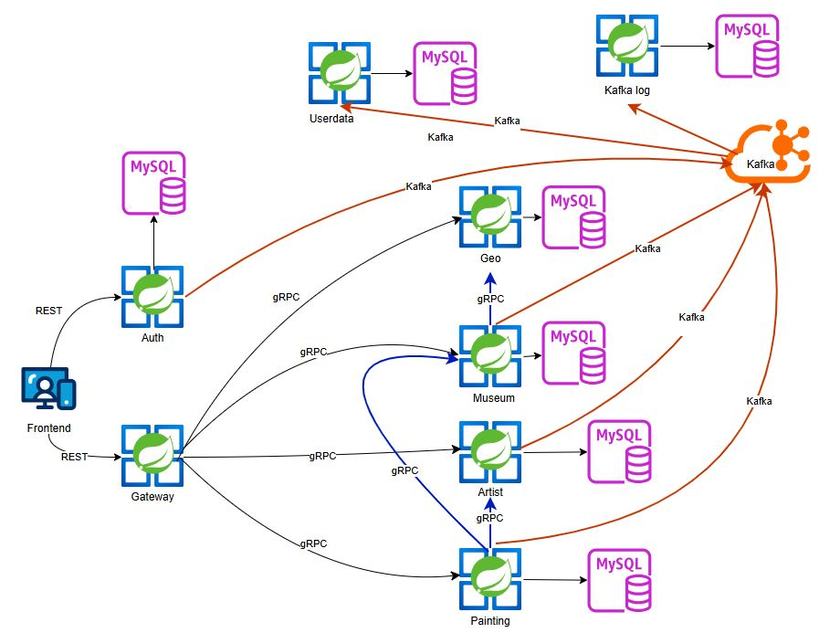
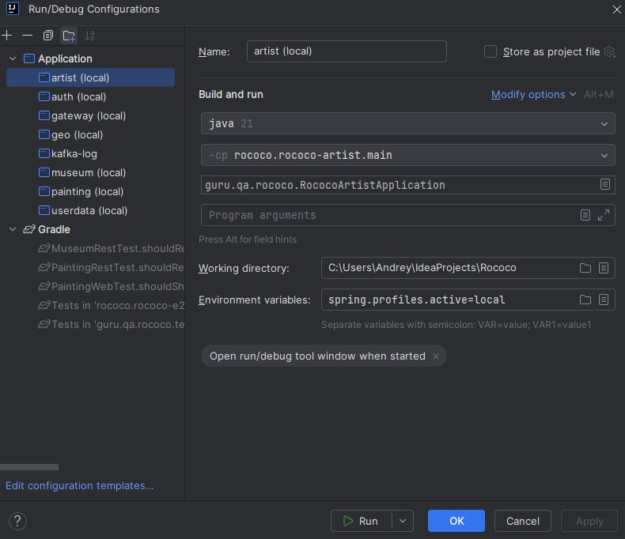
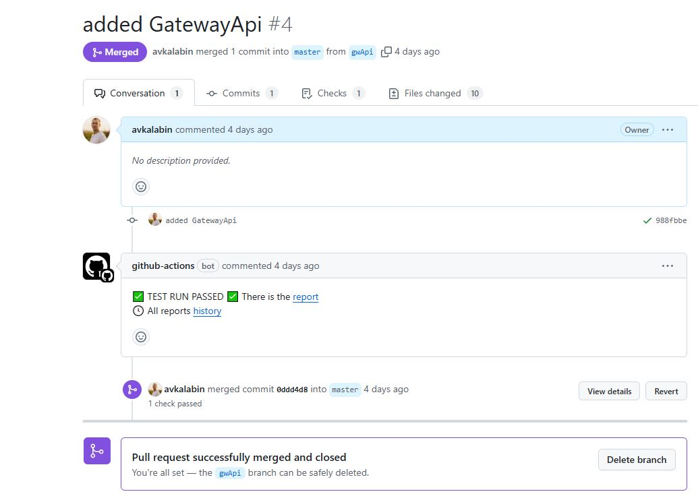
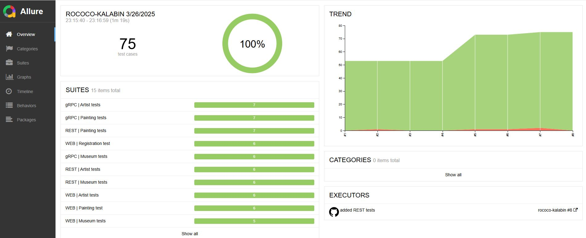
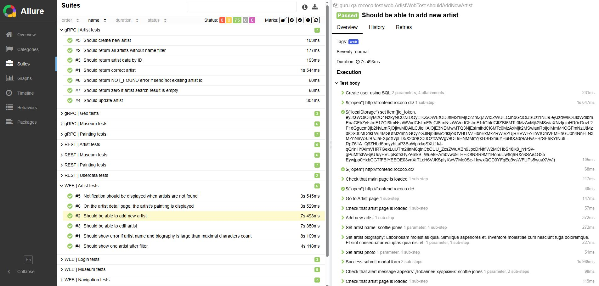

# Rococo


**Rococo — ваш личный гид в мире живописи! Погрузитесь в удивительный мир искусства, изучая шедевры великих мастеров, раскрывая тайны их создания и знакомясь с биографиями художников. Исследуйте коллекции известных музеев со всего мира, открывайте новые произведения и обогащайте свои знания о культуре и истории живописи. Rococo поможет вам окунуться в атмосферу искусства, где каждая картина — это история, а каждый музей — целый мир вдохновения.**


## Содержание

- [Используемые технологии](#technology)
- [Архитектура приложения](#architecture)
- [Сетевые порты и их назначение](#ports)
- [Минимальные предусловия для запуска проекта локально](#minimum-system-requirements)
- [Запуск Rococo локально в IDE](#local-run)
- [Запуск Rococo в Docker](#docker-run)
- [Запуск тестов в локальном окружении](#local-run-tests)
- [Запуск тестов в Docker](#docker-run-tests)
- [Автоматический запуск тестов в Github Actions](#gha)
- [Пример Allure отчёта](#report)

<a name="technology"></a>
## Используемые технологии

- [Spring Authorization Server](https://spring.io/projects/spring-authorization-server)
- [Spring OAuth 2.0 Resource Server](https://docs.spring.io/spring-security/reference/servlet/oauth2/resource-server/index.html)
- [Spring data JPA](https://spring.io/projects/spring-data-jpa)
- [Spring Web](https://docs.spring.io/spring-framework/docs/current/reference/html/web.html#spring-web)
- [Spring actuator](https://docs.spring.io/spring-boot/docs/current/reference/html/actuator.html)
- [Spring web-services](https://docs.spring.io/spring-ws/docs/current/reference/html/)
- [Apache Kafka](https://developer.confluent.io/quickstart/kafka-docker/)
- [Docker](https://www.docker.com/resources/what-container/)
- [Docker-compose](https://docs.docker.com/compose/)
- [MySQL](https://www.mysql.com/about/)
- [Svelte](https://svelte.dev/)
- [Thymeleaf](https://www.thymeleaf.org/)
- [JUnit 5 (Extensions, Resolvers, etc)](https://junit.org/junit5/docs/current/user-guide/)
- [Retrofit 2](https://square.github.io/retrofit/)
- [Allure](https://docs.qameta.io/allure/)
- [Selenide](https://selenide.org/)
- [Selenoid & Selenoid-UI](https://aerokube.com/selenoid/latest/)
- [Allure-docker-service](https://github.com/fescobar/allure-docker-service)
- [Java 21](https://adoptium.net/en-GB/temurin/releases/)
- [Gradle 8.6](https://docs.gradle.org/8.6/release-notes.html)
- [GHA](https://docs.github.com/en/actions)
- И многие другие

<a name="architecture"></a>
## Архитектура приложения

Приложение Rococo построено на основе микросервисной архитектуры:

- **auth** - управление процессами аутентификации и авторизации.
- **gateway** - централизованная обработка клиентских запросов и маршрутизация к нужным микросервисам.
- **userdata** - хранение информации о пользователе.
- **museum** - информация о музеях.
- **geo** - данные о странах мира.
- **artist** - информация о художниках.
- **painting** - информация о картинах.
- frontend - пользовательский интерфейс приложения.

Пользователь взаимодействует с системой через auth и gateway, используя REST API, не имея прямого доступа к другим микросервисам.
Все клиентские запросы проходят через gateway, который маршрутизирует их к соответствующим сервисам по gRPC.
Сервисы также общаются друг с другом по gRPC, а кроме того информация о событиях в них передается в отдельный сервис для хранения логов через Kafka.



<a name="ports"></a>
## Сетевые порты и их назначение

|  Сервис  |     Порт      |
|:--------:|:-------------:|
|   AUTH   | 9000 (server) |
| GATEWAY  | 8090 (server) |
| USERDATA |  8091 (rest)  |
|  ARTIST  |  8092 (rest)  |
|  MUSEUM  |  8093 (rest)  |
|   GEO    |  8094 (gRPC)  |
| PAINTING |  8095 (rest)  |
| FRONTEND |  80 (server)  |

<a name="minimum-system-requirements"></a>
**Минимальные предусловия для запуска проекта локально**

- На Windows рекомендуется используется терминал bash, а не powershell
- Установить Docker
- Установить Java версии 21 или новее
- Установить Gradle (рекомендуемая версия 8.6 или выше)
- Установить пакетный менеджер для сборки front-end npm <br>
  [Инструкция](https://docs.npmjs.com/downloading-and-installing-node-js-and-npm) Рекомендованная версия Node.js - 22.6.0
- Создать volume для сохранения данных из БД в docker на вашем компьютере
```posh
docker volume create rococo-mysql
```

<a name="local-run"></a>
## Запуск Rococo локально в IDE:

#### 1. Запустить фронтенд, БД, zookeeper и kafka:

Запустив скрипт:
```posh
$ bash localenv.sh
```

Или выполнив последовательно команды:
```posh
docker run --name rococo-all -p 3306:3306 -e MYSQL_ROOT_PASSWORD=secret -d mysql:8.0.33

docker run --name=zookeeper -e ZOOKEEPER_CLIENT_PORT=2181 -e ZOOKEEPER_TICK_TIME=2000 -p 2181:2181 -d confluentinc/cp-zookeeper:7.3.2

docker run --name=kafka -e KAFKA_BROKER_ID=1 -e KAFKA_ZOOKEEPER_CONNECT=$(docker inspect zookeeper --format='{{ .NetworkSettings.IPAddress }}'):2181 -e KAFKA_ADVERTISED_LISTENERS=PLAINTEXT://localhost:9092 -e KAFKA_OFFSETS_TOPIC_REPLICATION_FACTOR=1 -e KAFKA_TRANSACTION_STATE_LOG_MIN_ISR=1 -e KAFKA_TRANSACTION_STATE_LOG_REPLICATION_FACTOR=1 -p 9092:9092 -d confluentinc/cp-kafka:7.3.2

cd rococo-client
npm i
npm run dev
```
Фронт стартанет в браузере на порту 3000: http://127.0.0.1:3000/
#### 2. Прописать run конфигурацию для всех сервисов rococo-* - Active profiles local

Для этого зайти в меню Run -> Edit Configurations -> выбрать main класс -> в поле Environment variables указать spring.profiles.active=local

#### 3 Запустить сервис rococo-auth c помощью gradle или командой Run в IDE:

```posh
$ cd rococo-auth
$ gradle bootRun --args='--spring.profiles.active=local'
```

#### 4  Запустить в любой последовательности другие сервисы: artist, museum, painting, gateway, userdata, geo, kafka-log

<a name="docker-run"></a>
## Запуск Rococo в Docker

#### 1. Создать бесплатную учетную запись на https://hub.docker.com/ (если отсутствует)

#### 2. Создать в настройках своей учетной записи access_token [Инструкция](https://docs.docker.com/docker-hub/access-tokens/).

#### 3. Выполнить docker login с созданным access_token (в инструкции это описано)

#### 4. Прописать в etc/hosts доменное имя для сервисов

#### frontend:  127.0.0.1 frontend.rococo.dc,
#### auth:      127.0.0.1 auth.rococo.dc
#### gateway:   127.0.0.1 gateway.rococo.dc
Также сразу добавить в этот файл псевдоним allure для последующего запуска тестов:
#### 127.0.0.1 allure

Для *nix:
```posh
$ vi /etc/hosts
```
```posh
##
# Host Database
#
# localhost is used to configure the loopback interface
# when the system is booting.  Do not change this entry.
##
127.0.0.1       localhost
127.0.0.1       frontend.rococo.dc
127.0.0.1       auth.rococo.dc
127.0.0.1       gateway.rococo.dc
127.0.0.1       allure
```

В windows файл hosts лежит по пути:
```
C:\Windows\System32\drivers\etc\hosts
```

#### 5. Перейти в корневой каталог проекта

```posh
$ cd rococo
```

#### 6. Запустить все сервисы

```posh
$ bash docker-compose-dev.sh
```

Текущая версия docker-compose-dev.sh удалит все старые Docker контейнеры в системе, поэтому если у Вас есть созданные
контейнеры для других проектов - отредактируйте строку ```posh docker rm $(docker ps -a -q)```, чтобы включить в grep
только те контейнеры, которые относятся к rococo.

Rococo при запуске в докере будет работать для Вас по адресу http://frontend.rococo.dc:80, этот порт не нужно
указывать в браузере, таким образом переходить напрямую по ссылке http://frontend.rococo.dc

<a name="local-run-tests"></a>
## Запуск тестов в локальном окружении

**Обратите внимание! Запуск тестов происходит в три потока. Изменить число потоков можно в
файле junit-platform.properties**

1. Запустить приложение локально и запустить тесты из корня проекта
```posh
$ ./gradlew :rococo-tests:clean test
```

2. После прогона тестов запустить формирование отчёта командой:
```posh
$ ./gradlew :rococo-tests:allureServe
```
<a name="docker-run-tests"></a>
## Запуск тестов в Docker
1.  Запустить скрипт:
```posh
$ bash docker-compose-e2e.sh
```
2. Дополнительные варианты запуска

По умолчанию тесты будут запущены в браузер Chrome. Можно выбрать Firefox, передав его название в параметрах команды:
```posh
bash docker-compose-e2e.sh firefox
```

Чтобы не выполнять повторную сборку и только перезапустить тестовый контейнер:
```posh
bash docker-compose-e2e.sh --skip-build
```
Также можно использовать одновременно выбор браузера и пропуск сборки:
```posh
bash docker-compose-e2e.sh firefox --skip-build
```

3. После того, как все контейнеры успешно соберутся и запустятся - переключиться на логи контейнера rococo-tests командой:
```posh
$ docker logs -f rococo-e2e
```
4. После прогона аллюр отчёт будет доступен по адресу allure:5252

<a name="gha"></a>
## Автоматический запуск тестов в Github Actions

При создании pull request в репозитории тесты будут выполнены автоматически и в pull request будет добавлена ссылка на отчёт.



<a name="report"></a>
## Пример Allure отчёта


